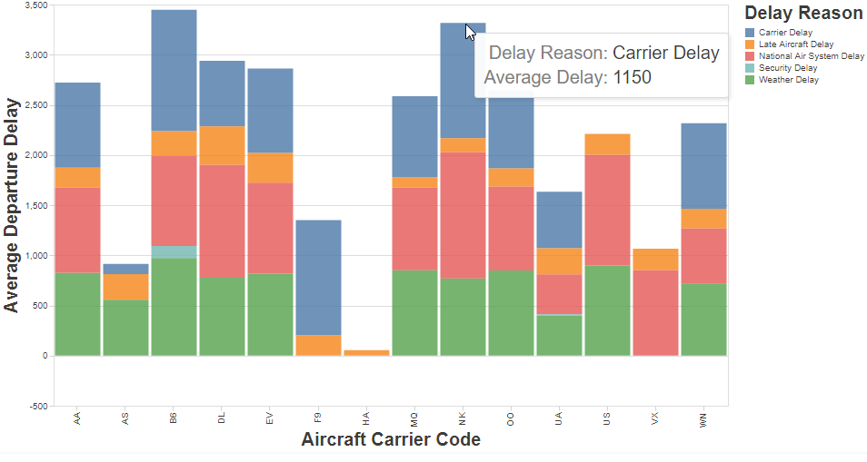
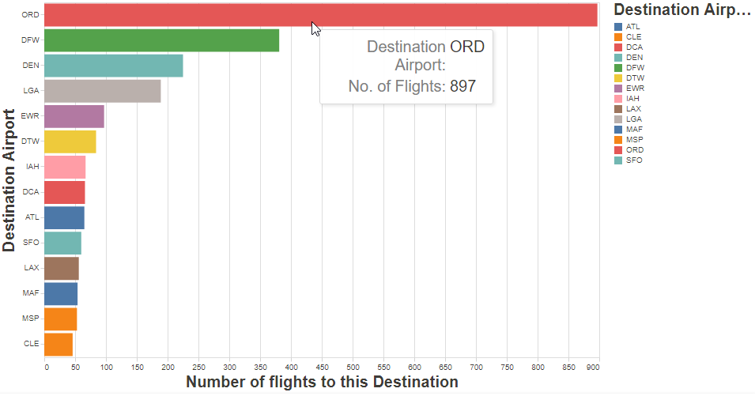
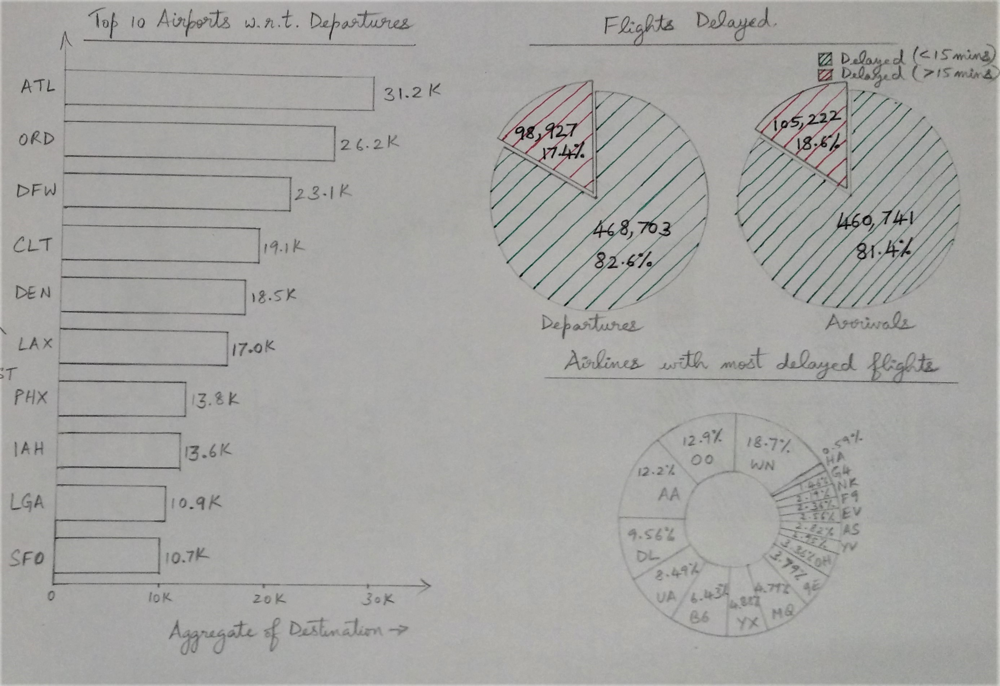
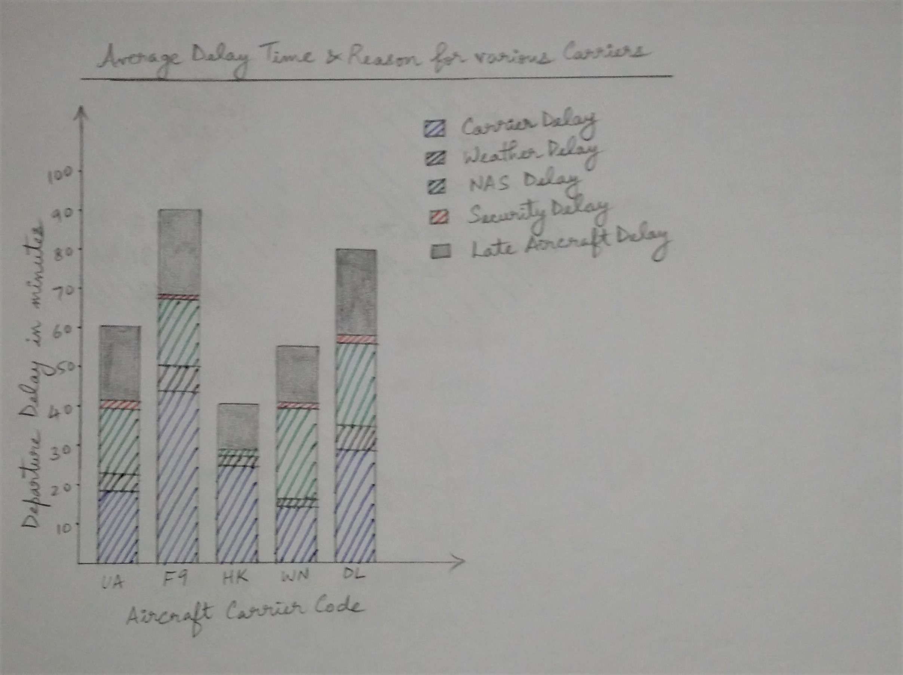

# Data Visualization Project

## Data

The data I propose to visualize for my project is [Flight Delay Analysis Dataset](https://gist.github.com/josvin92/9a6b89cb9365b1042d6648fc584c3198)

## Prototypes

I’ve created two proof of concept visualizations of this data. 

The first one is a stacked bar chart and this chart meant to show the "Average Delay Time and Delay Reason for various airline carriers". The color denotes the delay reason. The Delay Reason and the Avg Delay Time for each airline are shown on the tooltip as well as when you hover over it.

The second one is a simple bar chart and it shows the Top 15 Airports with respect to Departures sorted by the number of departures to each airport in descending order.
Each Airport is denoted by a different color. The Airports are represented by their IATA Codes.

## Questions & Tasks

The following tasks and questions will drive the visualization and interaction decisions for this project:

 * Which Aircraft Carrier has the highest average departure delay?
 * Which Aircraft Carrier has the lowest average departure delay? 
 * For the B6 Carrier, what was the major cause of delay? 
 * Which type of Delay caused the Max Avg Departure Delay?How much was the delay and for which aircraft was it? 
 * For each Aircraft Carrier, what are the delays they can reduce so as to increase on-time performance?
 * The concentration of delay and non-delay both on departure and on arrival?
 * The proportion of delayed flights that were diverted?
 * Are delays due to day_of_week and day_of_month?
 * The concentration of delays by 'Departure_Delay'?
 * Which airport in Origin stands out in delays?
 * Which airport in Destination stands out in delays?

 * What are the Top 15 Airports that have the most number of flights departing to?
 * How many flights depart to the most popular destination?
 * How many flights depart to the 15th most popular/least popular destination according to this graph?
 * What is the least popular destination from this graph?
 * What is the most popular destination from this graph?

 
## Sketches

(insert one or more hand-drawn sketches of interactive visualizations that you imagine)
(describe each sketch - how is the data visualized, what are the interactions, and how do these relate to the questions/tasks)

The first sketch is a simple bar chart and it shows the Top 10 Airports with respect to Departures sorted by the number of departures to each airport in descending order.
From this graph you'll be able to answer questions like What are the Top 15 Airports w.r.t departures, How many flights depart to the most popular destination, How many flights depart to the 15th most popular/least popular destination, What is the least popular destination from this graph, What is the most popular destination from this graph etc.

The second sketch shows two pie charts showing the number of flights delayed at departure as well as at arrival. The pie chart is also divided into two slices based on whether the departure was greater than or less than 15 mins.

The third chart is a donut chart showing the airlines with the most delayed flights and the percent share of each carrier with respect to the total delay.

The fourth chart is a stacked bar chart and it shows the "Average Delay Time and Delay Reason for various airline carriers". The color denotes the delay reason.

These charts should interact with each other and when we select a particualr airline carrier on the donut chart, the stacked bar chart should show the delay reasons for that particular carrier, the pie chart should show whether the delays were greater than or less than 15 mins and if so what was their share of the total delay for that carrier. Lastly, the simple bar chart should show the top destinations that this airline carrier departs to.

## Open Questions

(describe any fear, uncertainty, or doubt you’re having about the feasibility of implementing the sketched system. For example, “I’m not sure where to get the geographic shapes to build a map from this data” or “I don’t know how to resolve the codes to meaningful names” … Feel free to delete this section if you’re confident.)
