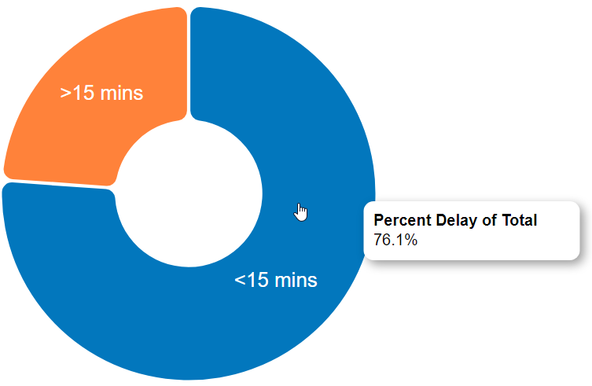
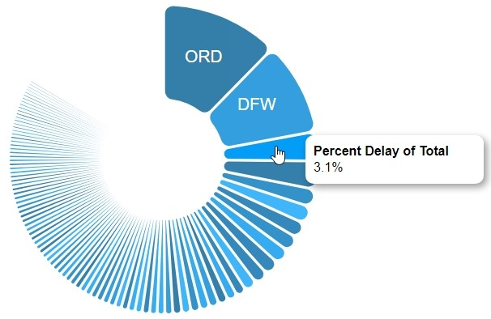

[![Contributors][contributors-shield]][contributors-url]
[![Forks][forks-shield]][forks-url]
[![Issues][issues-shield]][issues-url]
[![LinkedIn][linkedin-shield]][linkedin-url]
[![license][license-shield]][license-url]

# Data Visualization Project - Flight Delay Analysis

## Table of Contents

* [Data](#Data)  
* [Built With](#built-with)
* [Prototypes or Charts](#Prototypes-or-Charts)
* [Questions or Tasks](#Questions-or-Tasks)
* [Sketches](#Sketches)
* [Ideas for interaction](#Ideas-for-interaction)
* [Schedule of Deliverables](#schedule-of-deliverables)
* [Portfolio Video](#Portfolio-Video)
* [Future Work](#Future-Work)
* [License](#license)

## Data

The data I propose to visualize for my project is [Flight Delay Analysis Dataset](https://gist.github.com/josvinjohn/9a6b89cb9365b1042d6648fc584c3198)

## Built With
* [D3.js-5.11.0](https://unpkg.com/d3@5.11.0/dist/d3.min.js)
* [React.js-16.9.0](https://unpkg.com/react@16.9.0/umd/react.production.min.js)
* [VegaLite-4.16.8](https://vega.github.io/vega-lite/)

## Prototypes or Charts

I’ve created eight proof of concept visualizations/charts and two dashboards of this data. 

### Stacked Bar Chart
The first chart is a stacked bar chart which shows the "Average Delay Time and Delay Reason for various airline carriers". The color denotes the delay reason. The Delay Reason and the Avg Delay Time for each airline are shown on the tooltip when you hover over it. This chart below was created using D3.js.

### Simple Bar Chart
The second chart is a simple bar chart which shows the Top 15 Airports with respect to Departures sorted by the number of departures to each airport in descending order.
The Airports are represented by their IATA Codes.

The following chart was created using vega-lite api.

This chart below was created using D3.js.

### Pie Chart 1
The third chart is a simple pie chart showing the percentage of flights that were delayed by more than 15 mins and less than 15 mins with respect to departure.

### Pie Chart 2
The fourth chart is a simple pie chart showing the percentage of flights that were delayed by more than 15 mins and less than 15 mins with respect to arrival.

### Pie Chart 3
The fifth chart is a simple pie chart showing the percentage of flights delayed with respect to Departure for each airline.

### Pie Chart 4
The sixth chart is a simple pie chart showing the percentage of flights delayed with respect to Departure for each origin airport.

### Points on Map Chart
The seventh chart is a points on a map chart showing the Major U.S. Airports by Departure Delay. Size of the bubble represents the total delay at that airport.

### Histogram
The eighth chart is a histogram showing the Sum Total of Departure Delay for every hour of the day. This will help in analyzing which hours of the day have the most delay.

### Dashboard of Map and Histogram
The ninth chart is a dashboard which is a combination of the map and the histogram. The names of the city & state are shown on the tooltip when you hover over the data points on the map. The state also gets highlighted when you hover over it. You could also Pan & Zoom the map to view the major airports of specific states. Brushing with React Performance Optimization is included in the histogram linked to the map.

### Dashboard of Bar Charts and Pie Charts
The tenth chart is another dashboard which is a combination of the simple bar chart, stacked bar chart and the four pie charts. 
The frequency of the flights to each destination, average delay time and delay reason, percentage of flights delayed by 15 mins or more etc. are shown on the tooltip when you hover over the data points on the respective charts.

## Questions or Tasks

The following 5 tasks and questions will majorly drive the visualization and interaction decisions for this project:

 * Which type of Delay caused the Max Avg Departure Delay?How much was the delay and for which airline was it? 
 * The concentration of delay(>15 mins) and non-delay(<15 mins) both on departure('Departure_Delay') and on arrival('Arrival_Delay')? 
 * What are the Top 15 Airports that have the most number of flights departing to? What is the most popular one and the least popular one among those 15 airports? 
 * Among the delayed flights which airline/airport had the highest share of the delay w.r.t Total Delay of all flights? 
 * Do the most delays occur at a particular time of the day and if so which airports does it occur mostly? 

Other tasks and questions that will drive the visualization and interaction decisions for this project are as follows:

 * Which Aircraft Carrier has the highest average departure delay?
 * Which Aircraft Carrier has the lowest average departure delay? 
 * For the B6 Carrier, what was the major cause of delay? 
 * For each Aircraft Carrier, what are the delays they can reduce so as to increase on-time performance?
 
 * Are delays due to day_of_week and day_of_month?
 * The concentration of delays by 'Departure_Delay'?
 * Which airline has the highest percentage of delayed flights?
 * Which airport in Origin stands out in delays?
 * Which airport in Destination stands out in delays?

 * How many flights depart to the most popular destination?
 * How many flights depart to the 15th most popular/least popular destination according to this graph?
 * What is the least popular destination from this graph?
 * What is the most popular destination from this graph?

 
## Sketches

1. The first sketch is a simple bar chart and it shows the Top 10 Airports with respect to Departures sorted by the number of departures to each airport in descending order.
From this graph you'll be able to answer questions like:
    - What are the Top 15 Airports w.r.t departures, 
    - How many flights depart to the most popular destination, 
    - How many flights depart to the 15th most popular/least popular destination, 
    - What is the least popular destination from this graph, 
    - What is the most popular destination from this graph etc.

2. The second sketch shows two pie charts showing the number of flights delayed at departure as well as at arrival. The pie chart is also divided into two slices based on whether the departure was greater than or less than 15 mins. 

3. The third chart is a donut chart showing the airlines with the most delayed flights and the percent share of each carrier with respect to the total delay. Similar charts could be created for airports that stand out in delays w.r.t Origin/Destination.

4. The fourth chart is a stacked bar chart and it shows the "Average Delay Time and Delay Reason for various airline carriers". The color denotes the delay reason.
From this graph you'll be able to answer questions like:
   * Which Aircraft Carrier has the highest average departure delay?
   * Which Aircraft Carrier has the lowest average departure delay? 
   * For the B6 Carrier, what was the major cause of delay? 
   * Which type of Delay caused the Max Avg Departure Delay?How much was the delay and for which aircraft was it? 
   * For each Aircraft Carrier, what are the delays they can reduce so as to increase on-time performance?
 
Thus, we would be able to answer questions like which airline has the highest departure delay and whether most of the delay was less than or greater than 15 mins and what were the reasons for the delay. 

## Ideas for interaction

Selecting, hovering(tooltip), zooming/brushing have been included in the charts/dashboards. One example of brushing is selecting a bunch of bars of the histogram and the corresponding data points getting highlighted on the map.

Additionally, linked highlighting, shared navigation as well as menus/sliders could be incorporated into the afore mentioned charts in the future, so as to provide interaction between the various charts.

## Schedule of Deliverables

- October 7th - A simple bar chart showing the "Top 10 Airports with respect to Origin/Departures" has been completed. Also, the stacked bar chart showing the "Average Delay Time and Delay Reason for various airline carriers" has been completed.
- October 14th - Two pie charts have been completed showing the percentage of flights that were delayed at departure and arrival. The color denotes whether the delay was more than 15 mins or less than 15 mins. The tooltip shows the percentage delay w.r.t total delay of all flights.
- October 21st - Two donut charts have been completed showing the airlines with the most delayed flights as well as the airports with the most delayed flights. Also, created a points on a map(with size) showing U.S. airports that have the most delays and a scatter plot showing the sum of departure delay for each hour of the day.
- October 28th - Created a histogram from the scatter plot and then combined the map and the histogram to a single view. The names of the city & state are shown on the tooltip when you hover over the data points on the map. The state also gets highlighted when you hover over it. You could also Pan & Zoom the map to view the major airports of specific states. Finally, enabled Brushing with React Performance Optimization for the histogram which is linked to the map.
- November 4th - Converted vega-lite charts to D3 and combined the bar chart, stacked bar chart as well as the remaining pie charts to a single dashboard.

## Portfolio Video

## Future Work

Since we have a map showing all the airports and their total delays, it would be quite interesting to plot connections between airports on a map.
Additionally, we could add an interactive color legend or multi-select menu to the stacked bar chart and enable brushing for both the bar charts on the final dashboard. 

One example of brushing that could be done in the future is on selecting a bunch of airlines showing the average delay and delay reason and the corresponding charts showing which airline had the highest delay and what percentage of that was delayed by less than 15 mins and what percentage was delayed by more than 15 mins as well as the share of the total delay for those airlines or airports.

We could also create a time series chart to figure out the average delay over time for each airline. 

Some more ideas related to airline dataset can be found at: https://square.github.io/crossfilter/

## License

Distributed under the MIT License. See [`LICENSE`](https://github.com/josvinjohn/dataviz-project-proposal-flight-delay-analysis/blob/master/LICENSE) for more information.

<!-- MARKDOWN LINKS & IMAGES -->
<!-- https://www.markdownguide.org/basic-syntax/#reference-style-links -->
[contributors-shield]: https://img.shields.io/github/contributors/josvinjohn/dataviz-project-proposal-flight-delay-analysis
[contributors-url]: https://github.com/josvinjohn/dataviz-project-proposal-flight-delay-analysis/graphs/contributors

[forks-shield]: https://img.shields.io/github/forks/josvinjohn/dataviz-project-proposal-flight-delay-analysis
[forks-url]: https://github.com/josvinjohn/dataviz-project-proposal-flight-delay-analysis/network/members

[issues-shield]: https://img.shields.io/github/issues/josvinjohn/dataviz-project-proposal-flight-delay-analysis
[issues-url]: https://github.com/josvinjohn/dataviz-project-proposal-flight-delay-analysis/issues

[linkedin-shield]: https://img.shields.io/badge/-LinkedIn-black.svg?style=flat-square&logo=linkedin&colorB=555
[linkedin-url]: https://www.linkedin.com/in/josvin-john/

[license-shield]: https://img.shields.io/github/license/josvinjohn/dataviz-project-proposal-flight-delay-analysis.svg?style=flat-square
[license-url]: https://github.com/josvinjohn/dataviz-project-proposal-flight-delay-analysis/blob/master/LICENSE
