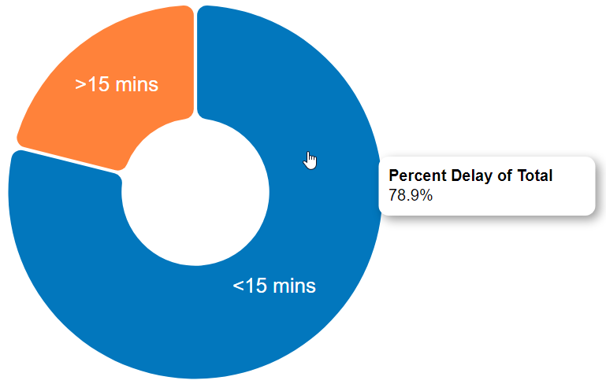

# Data Visualization Project

## Data

The data I propose to visualize for my project is [Flight Delay Analysis Dataset](https://gist.github.com/josvin92/9a6b89cb9365b1042d6648fc584c3198)

## Prototypes

I’ve created eight proof of concept visualizations of this data. 

The first one is a stacked bar chart and this chart meant to show the "Average Delay Time and Delay Reason for various airline carriers". The color denotes the delay reason. The Delay Reason and the Avg Delay Time for each airline are shown on the tooltip as well as when you hover over it.

The second one is a simple bar chart and it shows the Top 15 Airports with respect to Departures sorted by the number of departures to each airport in descending order.
Each Airport is denoted by a different color. The Airports are represented by their IATA Codes.

The third one is a simple pie chart showing the percentage of flights that were delayed by more than 15 mins and less than 15 mins w.r.t. departure.

The fourth one is a simple pie chart showing the percentage of flights that were delayed by more than 15 mins and less than 15 mins w.r.t. arrival.

The fifth one is a simple pie chart showing the percentage of flights delayed w.r.t Departure for each airline.

The sixth one is a simple pie chart showing the percentage of flights delayed w.r.t Departure for each origin airport.

The seventh one is a points on a map chart showing the Major U.S. Airports by Departure Delay. Size of the bubble represents the total delay at that airport.

The eighth one is a histogram showing the Sum Total of Departure Delay for every hour of the day. This will help in analyzing which hours of the day have the most delay.

The ninth one is a combination of the map and the histogram. The names of the city & state are shown on the tooltip when you hover over the data points on the map. The state also gets highlighted when you hover over it. You could also Pan & Zoom the map to view the major airports of specific states. Brushing with React Performance Optimization is included in the histogram linked to the map.

## Questions & Tasks

The following 5 tasks and questions will majorly drive the visualization and interaction decisions for this project:

 * Which type of Delay caused the Max Avg Departure Delay?How much was the delay and for which aircraft was it? 
 * The concentration of delay(>15 mins) and non-delay(<15 mins) both on departure('Departure_Delay') and on arrival('Arrival_Delay')? 
 * What are the Top 15 Airports that have the most number of flights departing to? What is the most popular one and the least popular one among those 15 airports? 
 * Among the delayed flights which airline/airport had the highest share of the delay w.r.t Total Delay of all flights? 
 * Do the most delays occur at a particular time of the day and if so which airports does it occur mostly? 

Other tasks and questions that will drive the visualization and interaction decisions for this project are as follows:

 * Which Aircraft Carrier has the highest average departure delay?
 * Which Aircraft Carrier has the lowest average departure delay? 
 * For the B6 Carrier, what was the major cause of delay? 
 * For each Aircraft Carrier, what are the delays they can reduce so as to increase on-time performance?
 
 * Are delays due to day_of_week and day_of_month?
 * The concentration of delays by 'Departure_Delay'?
 * Which airline has the highest percentage of delayed flights?
 * Which airport in Origin stands out in delays?
 * Which airport in Destination stands out in delays?

 * How many flights depart to the most popular destination?
 * How many flights depart to the 15th most popular/least popular destination according to this graph?
 * What is the least popular destination from this graph?
 * What is the most popular destination from this graph?

 
## Sketches

1. The first sketch is a simple bar chart and it shows the Top 10 Airports with respect to Departures sorted by the number of departures to each airport in descending order.
From this graph you'll be able to answer questions like:
    - What are the Top 15 Airports w.r.t departures, 
    - How many flights depart to the most popular destination, 
    - How many flights depart to the 15th most popular/least popular destination, 
    - What is the least popular destination from this graph, 
    - What is the most popular destination from this graph etc.

2. The second sketch shows two pie charts showing the number of flights delayed at departure as well as at arrival. The pie chart is also divided into two slices based on whether the departure was greater than or less than 15 mins. 

3. The third chart is a donut chart showing the airlines with the most delayed flights and the percent share of each carrier with respect to the total delay. Similar charts could be created for airports that stand out in delays w.r.t Origin/Destination.

4. The fourth chart is a stacked bar chart and it shows the "Average Delay Time and Delay Reason for various airline carriers". The color denotes the delay reason.
From this graph you'll be able to answer questions like:
   * Which Aircraft Carrier has the highest average departure delay?
   * Which Aircraft Carrier has the lowest average departure delay? 
   * For the B6 Carrier, what was the major cause of delay? 
   * Which type of Delay caused the Max Avg Departure Delay?How much was the delay and for which aircraft was it? 
   * For each Aircraft Carrier, what are the delays they can reduce so as to increase on-time performance?
 

These charts should interact with each other and when we select a particular airline carrier on the donut chart, the stacked bar chart should show the delay reasons for that particular carrier, the pie chart should show whether the delays were greater than or less than 15 mins and if so what was their share of the total delay for that carrier. It should show what percentage of those fights were diverted. Lastly, the simple bar chart should show the top destinations that this airline carrier departs to. Similarly, other charts should also be enabled to interact with each other. 

Thus, we would be able to answer questions like which airline has the highest departure delay and whether most of the delay was less than or greater than 15 mins and what were the reasons for the delay. We could also answer questions like what was the average delay over time for each airline using a time series chart. We could also answer questions like how many of the delayed flights were diverted to other airports and so on.

## Ideas for interaction

Selecting, hovering(tooltip), zooming/brushing, linked highlighting, shared navigation as well as menus/sliders could be incorporated into the afore mentioned charts so as to provide interaction between the various charts. One example would be brushing or selecting a bunch of airlines showing the average delay and delay reason and the corresponding charts showing which airline had the highest delay and what percentage of that was delayed by less than 15 mins and what percentage was delayed by more than 15 mins as well as what day or month had the maximum delay.

## Open Questions

At this point of time, I'm not sure about how to implement donut or pie charts using D3.js. 

## Schedule of Deliverables

- October 7th - A simple bar chart showing the "Top 10 Airports with respect to Origin/Departures" has been completed. Also, the stacked bar chart showing the "Average Delay Time and Delay Reason for various airline carriers" has been completed. (Took 12+ hrs)
- October 14th - Two pie charts have been completed showing the percentage of flights that were delayed at departure and arrival. The color denotes whether the delay was more than 15 mins or less than 15 mins. The tooltip shows the percentage delay w.r.t total delay of all flights. (Took 24+ hrs)
- October 21st - Two donut charts have been completed showing the airlines with the most delayed flights as well as the airports with the most delayed flights. Also, created a points on a map(with size) showing U.S. airports that have the most delays and a scatter plot showing the sum of departure delay for each hour of the day. (Took 24+ hrs)
- October 28th - Created a histogram from the scatter plot and then combined the map and the histogram to a single view. The names of the city & state are shown on the tooltip when you hover over the data points on the map. The state also gets highlighted when you hover over it. You could also Pan & Zoom the map to view the major airports of specific states. Finally, enabled Brushing with React Performance Optimization for the histogram which is linked to the map. (Estimated Time: 24+ hrs)
- November 4th - Add the remaining pie and bar charts to another dashboard and enable interaction between all of them. (Estimated Time: 24+ hrs)

## Future Work

Since we have a map showing all the airports and their total delays, It would be quite interesting to plot connections between airports on a map.

Some more ideas related to airline dataset can be found at: https://square.github.io/crossfilter/

